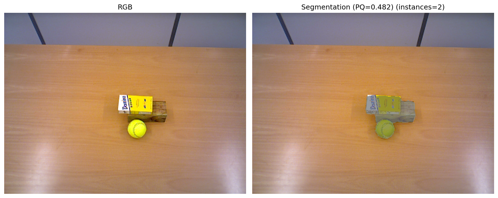

## Project Title

Tabletop Object Segmentation Pipeline

## Overview

This project implements a computer vision pipeline that segments individual objects placed on a tabletop using RGB and depth (RGB-D) data. The system detects the supporting plane (table surface) and separates objects above it, generating instance masks even when objects partially overlap.

The pipeline combines geometric reasoning from depth data with clustering techniques to accurately identify object boundaries and produce segmentation outputs suitable for downstream tasks such as robotic manipulation or scene understanding.

## Key Features

- Detects and removes the tabletop plane from depth data using RANSAC-based plane fitting
- Segments individual objects positioned above the surface
- Handles partially overlapping objects
- Generates instance masks for each detected object
- Supports evaluation and visualization of segmentation results

## Tech Stack
- Python
- NumPy
- SciPy
- Matplotlib

### Installation

- Python 3.8+ 
- Conda (Anaconda or Miniconda)

```bash
# Create environment
conda create -n rgbd-segmentation python=3.10
conda activate rgbd-segmentation

# Install dependencies
conda install numpy scipy matplotlib

#Verify Setup
python test.py --dataset dataset/easy --config config.json
```

### Running the Segmentation

Run the pipeline on the dataset using:

```bash
python test.py --dataset dataset/easy
```

To visualize segmentation outputs:

```bash
python3 test.py --dataset dataset/hard --visualize --vis-dir visualizations/
```
This will generate segmentation visualizations showing detected objects and instance masks.

## How It Works

1. Load RGB and depth data from the dataset
2. Detect the tabletop plane using RANSAC
3. Remove the plane to isolate object points
4. Apply clustering / segmentation techniques to separate objects
5. Generate instance masks for each detected object
6. Evaluate segmentation performance

## Example Results


